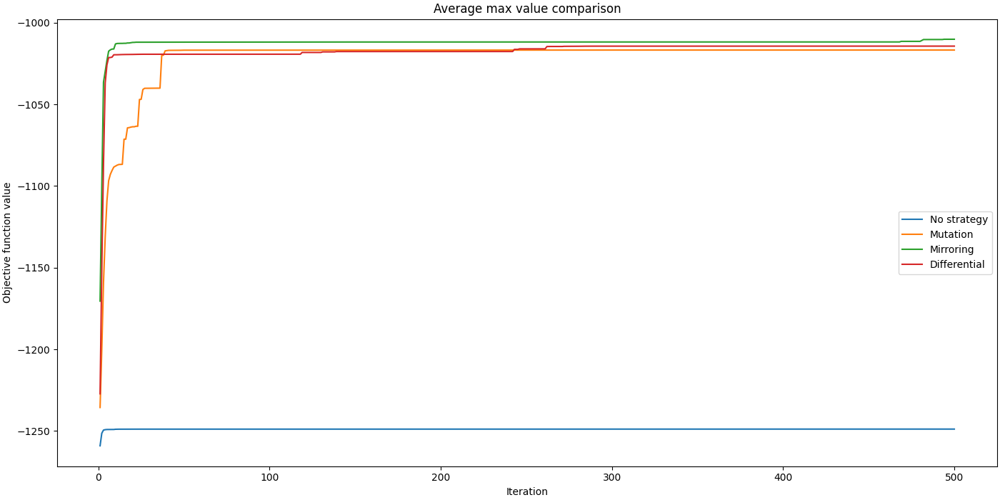

# Weakest Individuals 

### Authors: Radosław Radziukiewicz, Marcin Badach

---

The project target is to propose, implement and test various strategies 
of dealing with the weakest individuals appearing while running some
evolutionary algorithm. We hope that such strategies will enable better 
algorithm results while facing different optimization problems.

## Evolutionary algorithm

Since evolutionary algorithm word describes the 
[whole class of algorithms](https://en.wikipedia.org/wiki/Evolutionary_algorithm) 
we have to specify which algorithm we will be implementing. We decided 
to use the genetic algorithm.

## Benchmark

We will use [CEC2017 benchmark functions](https://github.com/P-N-Suganthan/CEC2017-BoundContrained)
to measure the genetic algorithm optimization results. The Python implementation,
which we are using, can be found [here](https://github.com/tilleyd/cec2017-py).

## Proposed strategies

We propose 3 different strategies of dealing with the weakest individuals. 
They are all described below.

### Mutation strategy

The weakest individuals will be mutated in order to generate new ones, which will replace them. The 
mutation strength of the strategy should be bigger when compared to the 
one used by genetic algorithm. 

The mutation strategy goal is to increase the algorithm exploration abilities.
By using the higher mutation strength algorithm may be less vulnerable to getting
stuck in local optima. 

### Average mirroring strategy

For the weakest individuals the **average individual** is computed. The average 
individual is an individual encoding the average value for every genom from 
the population. 

Next, for every individual belonging to the group of the weakest individuals,
the mirroring is performed. The vector between **average** and current individual is 
computed. The individual is moved by this vector with random strength generated 
with uniform distribution [0, 1). Depending on objective function, individual 
may be also moved by the generated vector, but with it direction changed 
(multiplied by -1).

### Differential evolution strategy

From the current population, the **leader** is selected. The leader is 
an individual with the best objective function value. The leader is 
selected from the whole population.

Next, for each of the weakest individuals the random **neighbour** is selected. The 
neighbour is selected only from the weakest individual's subpopulation.

The last step is to construct 2 displacement vectors, first pointing to the 
**leader** and second pointing to **neighbour** direction. For each of vector 
the random displacement strength is generated accordingly to uniform distribution 
[0, 1).

### Experiments

In order to test the following strategies we have proposed a way of executing and specifying
the so-called "Experiments". **Experiment** is multiple-times algorithm  execution 
along with its data gathering. Experiment averages all values gathered from all 
single times executions for further analysis.  
Conducting the Experiments is necessary in order to compare 
strategies. Single algorithm executions are biased with huge variance due to non-deterministic
nature of evolutionary algorithms.

### Comparison

We have developed a tool enabling to easily compare Experiments 
results in a graphical form. It plots data gathered by the 
Experiments and prints out the final values of obtained by algorithms (max, min and avg).

<h3 align="center">Fig. 1 - Sample results of F10 function experiment comparison</h3>

### Results

Extensive results of strategies comparison with description can be found [here](./doc/R_Radziukiewicz_M_Badach_POP_Dokumentacja.pdf).
Documentation is available in Polish only.

